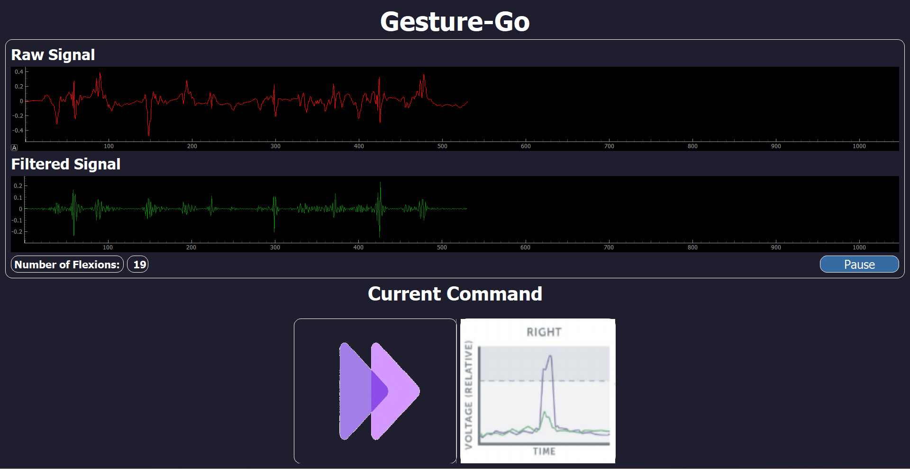

# Gesture-Go

## Introduction
Software Application that determines the directions of the wheelchair according to the hand gestures. This project focuses on utilizing the Bitalino kit to measure bio signals, particularly Electromyography (EMG), which provides valuable insights into muscle activity. By conducting experiments involving EMG signal acquisition and processing, we aim to gain a deeper understanding of health conditions related to muscle function.

## Experiment Overview
The experiment comprises two stages:

### Stage 1: Data Acquisition
In this stage, we will acquire EMG signals using the Bitalino kit and OpenSignals mobile application. The following tools are required:
- OpenSignals mobile application (downloaded and set up on a mobile device)
- Disposable electrodes for signal measurement
- Mobile charger to ensure continuous operation of the mobile device

### Stage 2: Data Processing
In the second stage, we will process the acquired EMG data. Participants can choose to work on one of the following tasks or select another bio signal and property to analyze:

#### Forearm Flexion Counter
Calculate the number of flexions in the EMG signal, preferably by placing electrodes on the biceps muscle.

## Screenshots




## Requirements
To run this project, you'll need the following dependencies installed:
- Python 3.x
- PyQt5
- Bitalino SDK
- OpenSignals mobile application

## Installation
1. Clone the repository to your local machine:
   ```
   git clone https://github.com/tahaaa22/project.git
   ```
2. Install dependencies using pip:
   ```
   pip install PyQt5
   pip install bitalino
   ```

## Usage
1. Acquire EMG signals using the Bitalino kit and OpenSignals mobile application.
2. Place electrodes on the desired muscle group (preferably biceps for forearm flexion task).
3. Ensure continuous operation of the mobile device with a mobile charger.
4. Process the acquired EMG data using the provided Python scripts.

## Contributing
Contributions are welcome! If you have any ideas for improvements or new features, feel free to open an issue or submit a pull request.

## Reference
https://www.researchgate.net/publication/362690679_Evaluating_surface_EMG_control_of_motorized_wheelchairs_for_amyotrophic_lateral_sclerosis_patients 
